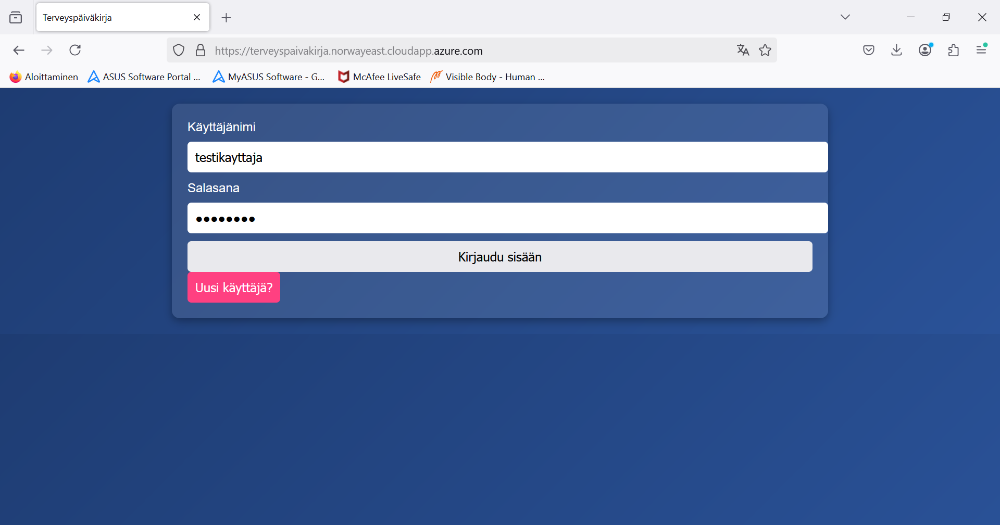
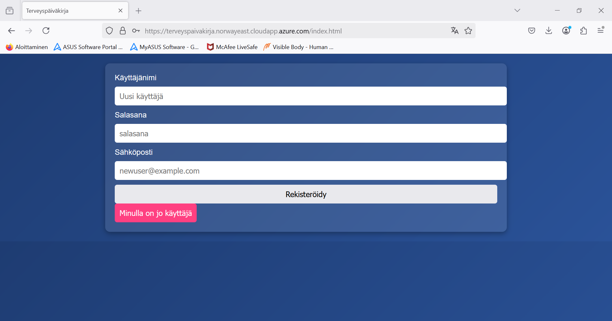
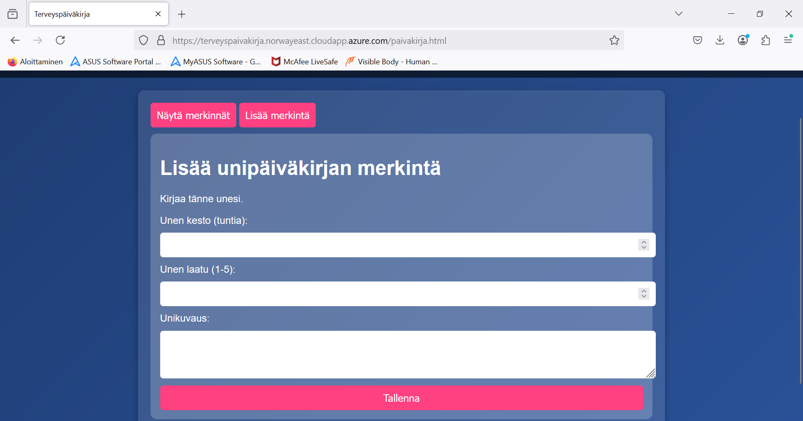
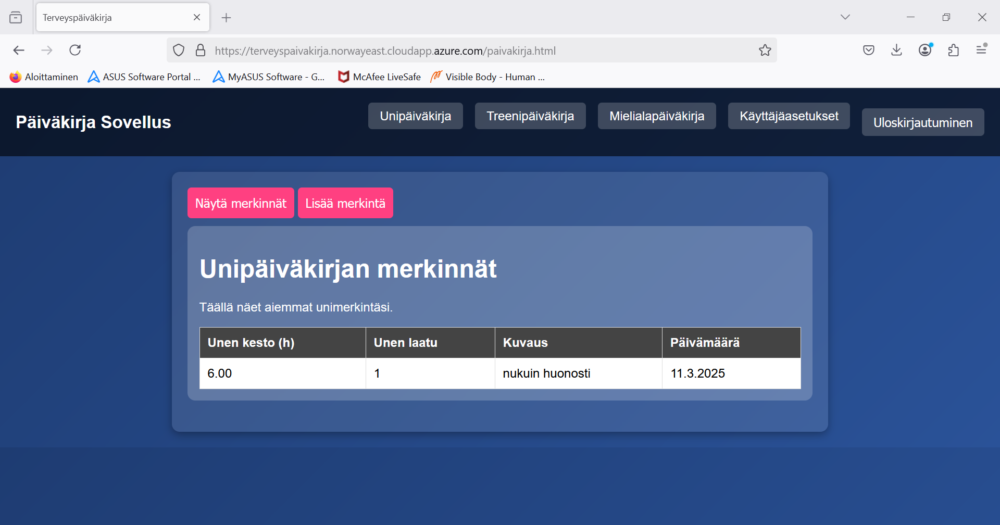
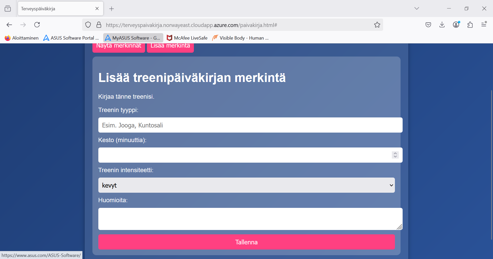
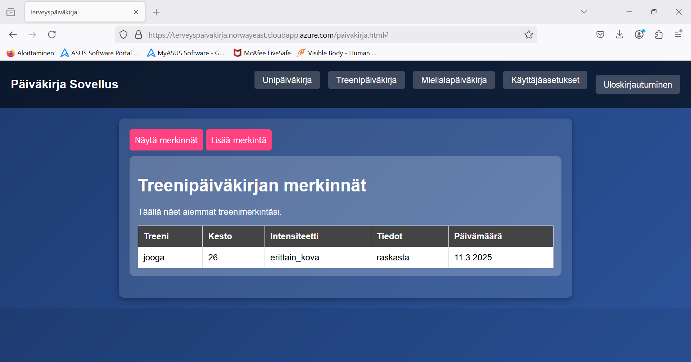
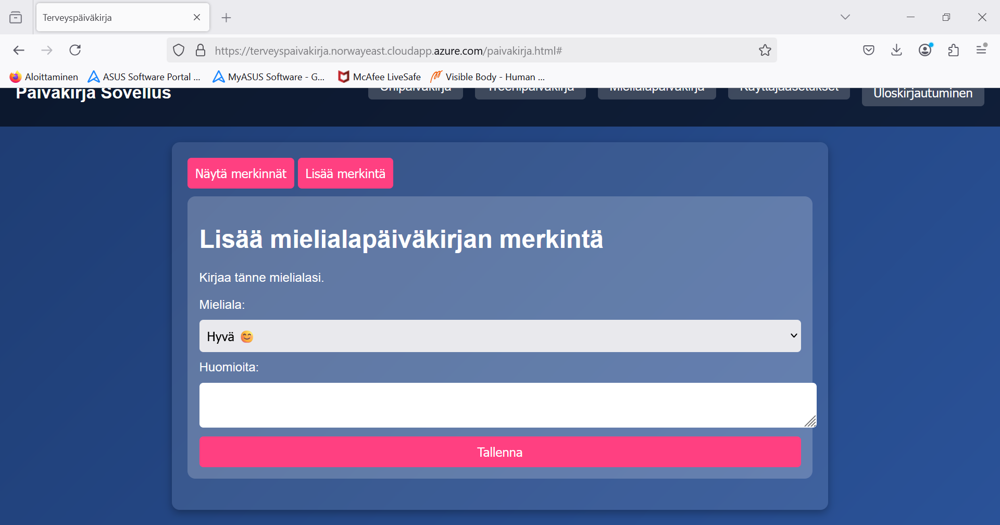
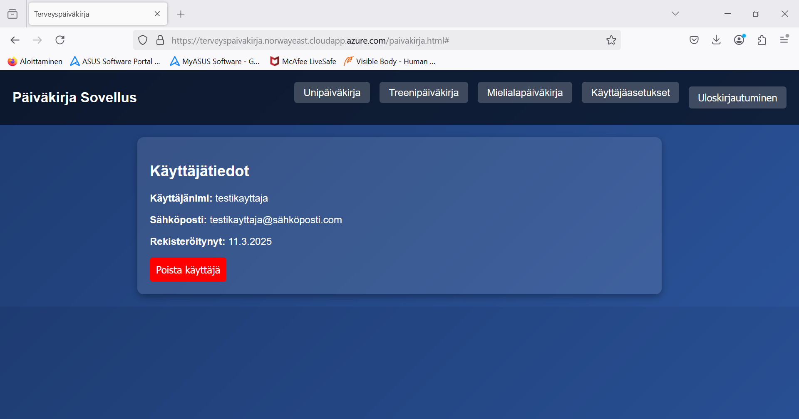

# Päiväkirja Sovellus

Sovellus tarjoaa käyttäjille mahdollisuuden hallita unipäiväkirjaa, treenipäiväkirjaa ja mielialapäiväkirjaa.

## Kuvankaappaukset käyttöliittymästä

## Linkit

 - [Sovellus](https://terveyspaivakirja.norwayeast.cloudapp.azure.com)
 - [API](https/terveyspaivakirja.norwayeast.cloudapp.azure.com/api)
 - [API-dokumentaatio](./API_DOCS.md)

## Tietokanta

Tietokanta on rakennettu **MySQL**:llä, ja se sisältää seuraavat taulut:

- **Roles** (role_id, name) Regular ja Admin
- **Users** (user_id, username, password, email, created_at, user_level)
- **DiaryEntries** (entry_id, user_id, sleep_duration, sleep_quality, dream_description, created_at)
- **Exercise** (exercise_id, user_id, type, duration, intensity, notes, created_at)
- **Mood** (mood_id, user_id, mood, notes, created_at)

## Toiminnallisuudet

### Autentikaatio ja käyttäjät
- Rekisteröityminen
- Kirjautuminen
- Käyttäjän tietojen hakeminen

### Päiväkirja
- Unipäiväkirjan merkinnät (luonti, näyttäminen)
- Treenipäiväkirjan merkinnät (luonti, näyttäminen)
- Mielialapäiväkirjan merkinnät (luonti, näyttäminen)
## Tiedossa olevat ongelmat
-  Rekisteröityminen ei anna tokenia
-  Käyttäjän poistaminen ei toimi
## Referenssit ja lähteet
- [Express.js](https://expressjs.com/)
- [MySQL](https://www.mysql.com/)
- [Node.js](https://nodejs.org/)
- [JWT Autentikaatio](https://jwt.io/)
- [Frontend: Vite + Vanilla JS](https://vitejs.dev/)
- [W3Schools](https://www.w3schools.com/)